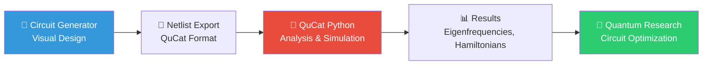

# QuCat Circuit Generator

> **⚠️ DOCUMENTATION WORK IN PROGRESS** 
> 
> This documentation is currently being restructured and enhanced. Some links may not work yet, and content is being actively updated. The core functionality is stable.

  
  <h1>Interactive Quantum Circuit Designer</h1>
  
<em>Visual design tool compatible with the <a href="https://github.com/qucat/qucat">QuCat Python Library</a> for quantum circuit analysis</em>

---

## 🎮 Try the Interactive Demo

  <iframe 
    src="embedded-demo.html" 
    width="100%" 
    height="700" 
    style="border: none; border-radius: 12px; background: #f8f9fa; box-shadow: 0 8px 25px rgba(0,0,0,0.1);"
    title="QuCat Circuit Generator">
  </iframe>

**🎯 Quick Controls:** C=Capacitor, L=Inductor, J=Junction, R=Resistor, W=Wire, G=Ground, Del=Delete, Ctrl+Z=Undo

## 🧭 Quick Navigation

**👤 I want to use the circuit generator** → [Getting Started Tutorial](./getting-started.md)

**👩‍� I want to create new components** → [Developer Guide](./EXTENSION_GUIDE.md)

**�📚 I need API reference** → [API Documentation](./dist/extension-api/)

---

## 📚 Documentation Structure

### 🎮 Getting Started (Users)
- **[🚀 Interactive Demo](embedded-demo.html)** - Try the circuit generator in your browser
- **[📚 Complete Tutorial](./getting-started.md)** - Step-by-step guide with auto-loaded examples
- **[⚡ Quick Start](../README.md)** - Installation and basic usage
- **[🔧 Features Overview](../features.md)** - Complete feature list and capabilities

### 👩‍💻 Developer Guide (Component Creation)
- **[🏗️ Extension Development](./EXTENSION_GUIDE.md)** - Complete guide for creating custom elements
- **[🔌 Component Creation](./EXTENSION_API.md)** - Quick patterns for new components
- **[🏛️ Architecture Guide](./architecture/README.md)** - Understanding the hexagonal architecture
- **[📐 Design Patterns](./architecture/c4-level3-component.md)** - Component structure and patterns

### 📋 API Documentation (Reference)
- **[🔍 API Reference](./dist/extension-api/)** - Complete JSDoc API documentation
- **[⚙️ Core Classes](./dist/extension-api/module-Domain_Entities.html)** - Element, Circuit, Properties
- **[🎨 Renderers](./dist/extension-api/module-GUI_Renderers.html)** - Rendering system API
- **[🔧 Services](./dist/extension-api/module-Application_Services.html)** - Circuit management API

### 📋 Project Information
- **[Performance Optimizations](../PERFORMANCE_OPTIMIZATIONS.md)** - Performance patterns and optimizations
- **[Component Sizing Summary](../COMPONENT-SIZING-SUMMARY.md)** - Circuit component specifications
- **[License](../LICENSE.md)** - MIT License

### 🔗 QuCat Ecosystem Integration
- **[QuCat Python Library](https://github.com/qucat/qucat)** - Quantum circuit analysis and simulation
- **[QuCat Documentation](https://qucat.readthedocs.io/)** - Complete QuCat library documentation
- **[QuCat Paper](https://quantum-journal.org/papers/q-2021-09-01-541/)** - "QuCat: quantum circuit analyzer tool in Python"

---

## 🎯 Quick Navigation by Use Case

### **🎮 I want to try the circuit generator immediately**
→ **[Launch Interactive Demo](./live-demo.html)** - No installation required!

### **📚 I want to learn how to use it with examples**
→ **[Getting Started Guide](./getting-started.html)** - Tutorial with auto-loaded circuits and QuCat integration

### **🧑‍💻 I want to use the circuit generator**
→ Start with [Installation Guide](../README.md) and [Getting Started Guide](./getting-started.html)

### **I want to understand the architecture** 
→ Read [Architecture Overview](./architecture/README.md) and [System Context](./architecture/c4-level1-system-context.md)

### **I want to extend the application**
→ Follow the [Extension Guide](./EXTENSION_GUIDE.md) and check [Extension API](./extension-api/index.html)

### **I want to contribute to development**
→ Review [Architecture Flow](./architecture/architecture-flow.md) and [Performance Optimizations](../PERFORMANCE_OPTIMIZATIONS.md)

---

## 🔬 QuCat Integration Workflow

This circuit generator is designed to work seamlessly with the QuCat Python ecosystem:

### Typical Research Workflow

1. **🎨 Visual Circuit Design**: Use this interactive tool to design quantum circuits
2. **📤 Export to QuCat**: Save circuits as QuCat-compatible netlists  
3. **🔬 Quantum Analysis**: Load netlists in QuCat Python for eigenfrequency calculations
4. **📊 Optimization**: Iterate between visual design and numerical analysis

### QuCat Compatibility

- **📄 Netlist Format**: Exports standard QuCat netlist syntax
- **🔧 Component Library**: Supports all QuCat circuit elements (R, L, C, J)
- **⚡ Josephson Junctions**: Full support for superconducting quantum circuits
- **🔌 Node Connectivity**: Maintains proper ground and connection topology

---

## 🏛️ Architectural Principles

This application follows **Hexagonal Architecture** with **Domain-Driven Design**:

- **🏗️ Domain Layer**: Core business logic (circuits, elements, validation)
- **⚡ Application Layer**: Orchestration services (CircuitService, use cases)
- **🎨 GUI Layer**: User interface adapters (renderers, commands, interactions)
- **⚙️ Infrastructure Layer**: External adapters (file I/O, QuCat format)

### Extension Philosophy

The architecture is designed for **clean extensibility**:

- **Registry Patterns**: Elements, renderers, and commands are registered, not hard-coded
- **Dependency Injection**: All dependencies are injected through constructor parameters
- **Event-Driven**: Loose coupling via domain events and reactive UI updates
- **Configuration-Driven**: Menu actions and bindings defined in YAML configuration

---

*Built with ❤️ for the quantum computing community*