# C4 Level 3: Component Diagram

This diagram shows the internal components within each container and their relationships.

```mermaid
C4Component
    title Component diagram for QuCat Circuit Generator

    Container_Boundary(gui, "GUI Layer") {
        Component(guiAdapter, "GUIAdapter", "JavaScript", "Central coordinator bridging UI events to domain commands")
        Component(circuitRenderer, "CircuitRenderer", "Canvas API", "Canvas-based rendering engine for visual circuit representation")
        Component(messagePopup, "MessagePopup", "Canvas API", "Canvas-based notification system for user feedback")
        Component(rendererFactory, "RendererFactory", "Factory Pattern", "Creates appropriate renderers for different element types")
        Component(commandRegistry, "CommandRegistry", "Registry Pattern", "Maps user actions to executable commands")
        Component(commandHistory, "CommandHistory", "Command Pattern", "Implements undo/redo functionality")
    }

    Container_Boundary(domain, "Domain Layer") {
        Component(circuitAggregate, "Circuit Aggregate", "DDD Aggregate", "Root aggregate managing entire circuit state")
        Component(elementEntities, "Element Entities", "DDD Entities", "Resistor, Capacitor, Inductor, Junction, Ground, Wire")
        Component(valueObjects, "Value Objects", "DDD Value Objects", "Position, Label, Properties, NodeId for immutable data")
        Component(elementRegistry, "ElementRegistry", "Factory Pattern", "Factory for creating domain elements")
        Component(domainServices, "Domain Services", "DDD Services", "Circuit validation and element relationship logic")
    }

    Container_Boundary(application, "Application Layer") {
        Component(circuitService, "CircuitService", "Application Service", "Main service orchestrating circuit operations")
        Component(eventEmitter, "EventEmitter", "Observer Pattern", "Enables event-driven architecture for state changes")
        Component(commands, "Command Implementations", "Command Pattern", "AddElement, DeleteElement, ConnectElement commands")
        Component(useCaseHandlers, "Use Case Handlers", "Application Logic", "Import/Export, Save/Load, Element manipulation")
    }

    Container_Boundary(infrastructure, "Infrastructure Layer") {
        Component(qucatAdapter, "QucatNetlistAdapter", "Adapter Pattern", "Converts circuits to/from QuCat netlist format")
        Component(fileRepository, "FileRepository", "Repository Pattern", "Handles local file operations")
        Component(configManager, "ConfigurationManager", "Configuration", "Manages application settings and element registration")
    }

    Rel(guiAdapter, commandRegistry, "Uses")
    Rel(guiAdapter, commandHistory, "Manages")
    Rel(guiAdapter, circuitRenderer, "Controls")
    Rel(circuitRenderer, rendererFactory, "Uses")
    Rel(circuitRenderer, messagePopup, "Shows notifications via")

    Rel(commandRegistry, commands, "Creates")
    Rel(commands, circuitService, "Executes via")
    Rel(circuitService, circuitAggregate, "Operates on")
    Rel(circuitService, eventEmitter, "Broadcasts events via")

    Rel(circuitAggregate, elementEntities, "Contains")
    Rel(elementEntities, valueObjects, "Composed of")
    Rel(elementRegistry, elementEntities, "Creates")

    Rel(useCaseHandlers, qucatAdapter, "Uses")
    Rel(useCaseHandlers, fileRepository, "Uses")
    Rel(configManager, elementRegistry, "Configures")

    UpdateLayoutConfig($c4ShapeInRow="2", $c4BoundaryInRow="1")
```

## Component Details

### GUI Layer Components
- **GUIAdapter**: Central coordinator that bridges UI events to domain commands
- **CircuitRenderer**: Canvas-based rendering engine for visual circuit representation
- **MessagePopup**: Canvas-based notification system for user feedback
- **RendererFactory**: Creates appropriate renderers for different element types
- **CommandRegistry**: Maps user actions to executable commands
- **CommandHistory**: Implements undo/redo functionality with command pattern

### Domain Layer Components
- **Circuit Aggregate**: Root aggregate managing the entire circuit state
- **Element Entities**: Resistor, Capacitor, Inductor, Junction, Ground, Wire
- **Value Objects**: Position, Label, Properties, NodeId for immutable data
- **ElementRegistry**: Factory for creating domain elements
- **Domain Services**: Circuit validation and element relationship logic

### Application Layer Components
- **CircuitService**: Main application service orchestrating circuit operations
- **EventEmitter**: Enables event-driven architecture for state changes
- **Command Implementations**: AddElement, DeleteElement, ConnectElement commands
- **Use Case Handlers**: Import/Export, Save/Load, Element manipulation

### Infrastructure Layer Components
- **QucatNetlistAdapter**: Converts circuits to/from QuCat netlist format
- **FileRepository**: Handles local file operations
- **ConfigurationManager**: Manages application settings and element registration