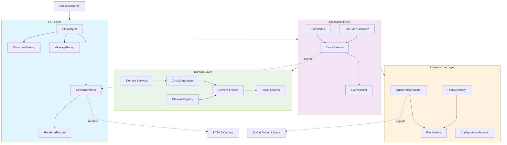

# Architecture Flow

This diagram shows the overall data flow and interactions between architectural layers.

## Data Flow Description

### User Interaction Flow
1. **User Input**: Circuit designer interacts with the GUI
2. **Event Processing**: GUIAdapter captures and processes events
3. **Command Execution**: Commands are routed through the application layer
4. **Domain Updates**: CircuitService orchestrates domain changes
5. **Event Broadcasting**: State changes are broadcast via EventEmitter
6. **UI Updates**: CircuitRenderer responds to events and re-renders

### Component Interactions

#### GUI Layer → Application Layer
- User actions trigger commands
- GUIAdapter coordinates with CircuitService
- Command history manages undo/redo operations

#### Application Layer → Domain Layer
- CircuitService orchestrates domain operations
- Commands manipulate Circuit aggregate
- Domain services enforce business rules

#### Application Layer → Infrastructure Layer
- Use case handlers coordinate external operations
- File operations for save/load functionality
- Format conversion for QuCat integration

### Event-Driven Architecture
- **State Changes**: Domain modifications trigger events
- **Reactive Updates**: GUI components respond to state events
- **Loose Coupling**: Components communicate via events rather than direct calls

## Architectural Benefits

1. **Separation of Concerns**: Clear layer boundaries
2. **Testability**: Isolated components with defined interfaces
3. **Extensibility**: New elements and features can be added easily
4. **Maintainability**: Changes are localized to specific layers
5. **Event-Driven**: Reactive UI updates without tight coupling