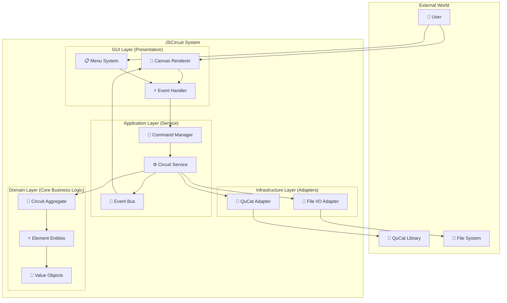
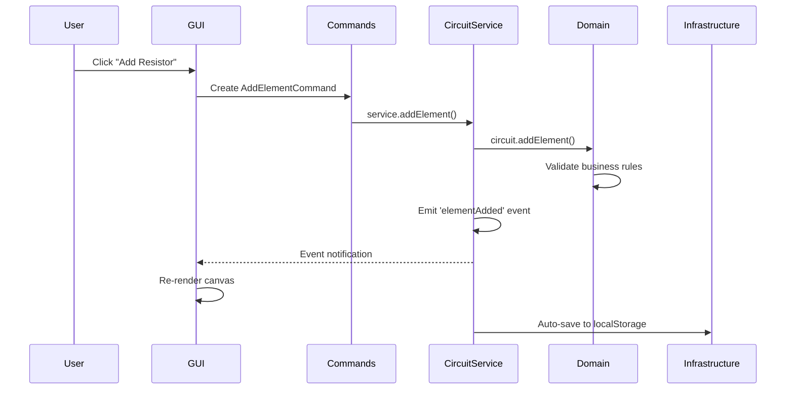
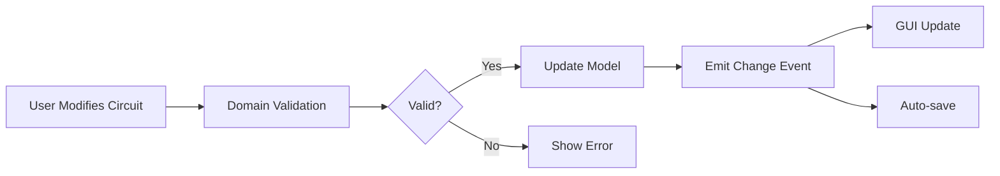

<div align="center">
  
  <h2>System Architecture & Design Principles</h2>
  <p><em>Understanding JSCircuit's Domain-Driven Design and Hexagonal Architecture</em></p>
</div>

---

## 🏛️ Architectural Overview

JSCircuit is built using **Domain-Driven Design (DDD)** with **Hexagonal Architecture** (Ports & Adapters pattern). This creates a maintainable, testable, and extensible quantum circuit design system.

### 🎯 Core Principles

1. **Domain Independence**: Core business logic has no external dependencies
2. **Separation of Concerns**: Each layer has a distinct responsibility
3. **Dependency Inversion**: High-level modules don't depend on low-level modules
4. **Event-Driven Architecture**: Components communicate through events
5. **Command Pattern**: All user actions are reversible commands

---

## 📐 System Layers



---

## 🏗️ Detailed Layer Architecture

### 🎨 GUI Layer (`src/gui/`)

**Purpose**: Handle user interaction and visual presentation

```
src/gui/
├── canvas/
│   ├── CanvasManager.js          # Main canvas controller
│   ├── EventHandler.js           # Mouse/keyboard events
│   └── SelectionManager.js       # Element selection logic
├── renderers/
│   ├── Renderer.js               # Abstract base renderer
│   ├── ResistorRenderer.js       # Component-specific rendering
│   └── WireRenderer.js           
├── commands/
│   ├── Command.js                # Abstract command interface
│   ├── AddElementCommand.js      # Add element with undo
│   └── DeleteElementCommand.js   # Delete element with undo
└── panels/
    ├── PropertyPanel.js          # Component property editing
    └── ToolPanel.js              # Tool selection UI
```

**Key Responsibilities**:
- Canvas rendering with HiDPI support
- User input handling (mouse, keyboard)
- Visual feedback (selection, hover states)
- Command creation and execution
- Property panel management

### ⚙️ Application Layer (`src/application/`)

**Purpose**: Orchestrate domain operations and coordinate between layers

```
src/application/
├── services/
│   ├── CircuitService.js         # Main circuit operations
│   ├── ElementService.js         # Element management
│   └── ValidationService.js     # Circuit validation
├── commands/
│   └── CommandManager.js        # Command execution & undo/redo
└── events/
    └── EventBus.js               # Event communication hub
```

**CircuitService** - Central orchestrator:

```javascript
class CircuitService extends EventEmitter {
    constructor(circuit, netlistAdapter, fileAdapter) {
        super();
        this.circuit = circuit;
        this.netlistAdapter = netlistAdapter;
        this.fileAdapter = fileAdapter;
    }
    
    addElement(elementType, position, properties) {
        const element = ElementFactory.create(elementType, position, properties);
        this.circuit.addElement(element);
        this.emit('elementAdded', element);
        return element;
    }
    
    exportToQuCat() {
        return this.netlistAdapter.circuitToNetlist(this.circuit);
    }
}
```

### 🧠 Domain Layer (`src/domain/`)

**Purpose**: Core business logic with no external dependencies

```
src/domain/
├── aggregates/
│   └── Circuit.js                # Root aggregate
├── entities/
│   ├── Element.js                # Abstract element base class
│   ├── Resistor.js               # Resistor business logic
│   ├── Capacitor.js              # Capacitor business logic
│   ├── Wire.js                   # Wire connection logic
│   └── Junction.js               # Junction node logic
├── valueObjects/
│   ├── Position.js               # Immutable position
│   ├── NodeId.js                 # Node identifier
│   └── Properties.js             # Component properties
└── factories/
    └── ElementFactory.js         # Element creation factory
```

**Circuit Aggregate** - Root entity:

```javascript
export class Circuit {
    constructor() {
        this.elements = new Map();
        this.nextNodeId = 1;
        this.version = 1;
    }
    
    addElement(element) {
        if (!element.isValid()) {
            throw new DomainError('Invalid element');
        }
        this.elements.set(element.id, element);
        this.version++;
    }
    
    removeElement(elementId) {
        this.elements.delete(elementId);
        this.version++;
    }
    
    validateCircuit() {
        // Domain business rules validation
        return new ValidationResult(this.elements);
    }
}
```

### 🔌 Infrastructure Layer (`src/infrastructure/`)

**Purpose**: External system adapters

```
src/infrastructure/
├── adapters/
│   ├── QucatNetlistAdapter.js    # QuCat netlist format
│   ├── FileSystemAdapter.js     # Browser file operations
│   └── LocalStorageAdapter.js   # Browser storage
└── validation/
    └── NetlistValidator.js       # Netlist format validation
```

---

## 🔄 Data Flow Patterns

### 🎬 User Action Flow



### 📊 Circuit Validation Flow



---

## 🎯 Key Design Patterns

### 🏭 Factory Pattern - Element Creation

```javascript
// src/domain/factories/ElementFactory.js
export class ElementFactory {
    static register(type, constructor) {
        this.constructors.set(type, constructor);
    }
    
    static create(type, id, nodes, label, properties) {
        const Constructor = this.constructors.get(type);
        if (!Constructor) {
            throw new Error(`Unknown element type: ${type}`);
        }
        return new Constructor(id, nodes, label, properties);
    }
}

// Registration in src/config/registry.js
ElementFactory.register('Resistor', Resistor);
ElementFactory.register('Capacitor', Capacitor);
```

### 📝 Command Pattern - Undo/Redo

```javascript
// Abstract command interface
export class Command {
    execute() { throw new Error('Must implement execute()'); }
    undo() { throw new Error('Must implement undo()'); }
    getDescription() { return 'Generic command'; }
}

// Concrete command implementation
export class AddElementCommand extends Command {
    constructor(circuitService, elementType, position, properties) {
        super();
        this.circuitService = circuitService;
        this.elementType = elementType;
        this.position = position;
        this.properties = properties;
        this.elementId = null;
    }
    
    execute() {
        const element = this.circuitService.addElement(
            this.elementType, this.position, this.properties
        );
        this.elementId = element.id;
    }
    
    undo() {
        this.circuitService.removeElement(this.elementId);
    }
}
```

### 🎪 Observer Pattern - Event System

```javascript
// EventBus for loose coupling
export class EventBus extends EventEmitter {
    static instance = new EventBus();
    
    static on(event, callback) {
        this.instance.on(event, callback);
    }
    
    static emit(event, data) {
        this.instance.emit(event, data);
    }
}

// Usage in services
class CircuitService {
    addElement(element) {
        this.circuit.addElement(element);
        EventBus.emit('circuit:elementAdded', { element });
    }
}

// Usage in GUI
class CanvasManager {
    constructor() {
        EventBus.on('circuit:elementAdded', this.onElementAdded.bind(this));
    }
    
    onElementAdded({ element }) {
        this.addRenderer(element);
        this.requestRedraw();
    }
}
```

---

## 🔧 Extension Architecture

### 🧩 Plugin System

JSCircuit supports extensions through a plugin architecture:

```javascript
// src/plugins/PluginManager.js
export class PluginManager {
    constructor() {
        this.plugins = new Map();
    }
    
    register(plugin) {
        // Register elements
        plugin.elements?.forEach(element => {
            ElementFactory.register(element.type, element.constructor);
        });
        
        // Register renderers
        plugin.renderers?.forEach(renderer => {
            RendererFactory.register(renderer.type, renderer.constructor);
        });
        
        // Register commands
        plugin.commands?.forEach(command => {
            CommandRegistry.register(command.name, command.implementation);
        });
        
        this.plugins.set(plugin.name, plugin);
    }
}
```

### 📦 Plugin Structure

```javascript
// Example plugin
export const QuantumGatesPlugin = {
    name: 'quantum-gates',
    version: '1.0.0',
    
    elements: [
        {
            type: 'QuantumGate',
            constructor: QuantumGateElement
        }
    ],
    
    renderers: [
        {
            type: 'QuantumGate',
            constructor: QuantumGateRenderer
        }
    ],
    
    commands: [
        {
            name: 'addQuantumGate',
            implementation: AddQuantumGateCommand
        }
    ],
    
    menuItems: [
        {
            path: 'quantum.gates.hadamard',
            label: 'Hadamard Gate',
            command: 'addQuantumGate'
        }
    ]
};
```

---

## 💾 Data Management

### 🏛️ Aggregate Root Pattern

**Circuit** serves as the aggregate root, maintaining consistency:

```javascript
export class Circuit {
    constructor() {
        this.elements = new Map();
        this.connections = new Map();
        this.metadata = new CircuitMetadata();
    }
    
    // Encapsulate business rules
    addElement(element) {
        this.validateElementAddition(element);
        this.elements.set(element.id, element);
        this.updateConnections(element);
        this.incrementVersion();
    }
    
    // Maintain invariants
    validateElementAddition(element) {
        if (this.hasConflictingElement(element)) {
            throw new DomainError('Element conflicts with existing elements');
        }
    }
    
    // Atomic operations
    moveElement(elementId, newPosition) {
        const element = this.elements.get(elementId);
        if (!element) return;
        
        const oldPosition = element.position;
        element.moveTo(newPosition);
        
        if (!this.isValidConfiguration()) {
            element.moveTo(oldPosition); // Rollback
            throw new DomainError('Invalid configuration');
        }
    }
}
```

### 📄 Serialization Strategy

```javascript
// Domain-focused serialization
export class CircuitSerializer {
    static toJSON(circuit) {
        return {
            version: circuit.version,
            metadata: circuit.metadata.toJSON(),
            elements: Array.from(circuit.elements.values()).map(element => ({
                id: element.id,
                type: element.type,
                nodes: element.nodes,
                label: element.label,
                properties: element.properties,
                position: element.position?.toJSON()
            }))
        };
    }
    
    static fromJSON(data) {
        const circuit = new Circuit();
        circuit.version = data.version;
        circuit.metadata = CircuitMetadata.fromJSON(data.metadata);
        
        data.elements.forEach(elementData => {
            const element = ElementFactory.create(
                elementData.type,
                elementData.id,
                elementData.nodes,
                elementData.label,
                elementData.properties
            );
            if (elementData.position) {
                element.position = Position.fromJSON(elementData.position);
            }
            circuit.addElement(element);
        });
        
        return circuit;
    }
}
```

---

## 🚀 Performance Architecture

### 🎨 Rendering Optimization

```javascript
// Efficient canvas rendering with dirty regions
export class CanvasManager {
    constructor() {
        this.dirtyRegions = new Set();
        this.renderRequestId = null;
        this.renderers = new Map();
    }
    
    markDirty(element) {
        const bounds = this.getElementBounds(element);
        this.dirtyRegions.add(bounds);
        this.scheduleRender();
    }
    
    scheduleRender() {
        if (this.renderRequestId) return;
        
        this.renderRequestId = requestAnimationFrame(() => {
            this.renderDirtyRegions();
            this.dirtyRegions.clear();
            this.renderRequestId = null;
        });
    }
}
```

### 🔄 Event System Optimization

```javascript
// Batched event processing
export class EventBus extends EventEmitter {
    constructor() {
        super();
        this.batchedEvents = new Map();
        this.batchTimeout = null;
    }
    
    emitBatched(event, data) {
        if (!this.batchedEvents.has(event)) {
            this.batchedEvents.set(event, []);
        }
        this.batchedEvents.get(event).push(data);
        
        this.scheduleBatchFlush();
    }
    
    scheduleBatchFlush() {
        if (this.batchTimeout) return;
        
        this.batchTimeout = setTimeout(() => {
            this.flushBatchedEvents();
        }, 16); // ~60fps
    }
}
```

---

## 🧪 Testing Architecture

### 🏗️ Test Structure

```
tests/
├── unit/
│   ├── domain/              # Pure domain logic tests
│   ├── application/         # Service layer tests
│   └── infrastructure/     # Adapter tests
├── integration/
│   ├── gui/                # GUI integration tests
│   └── end-to-end/         # Complete workflow tests
└── fixtures/
    ├── circuits/           # Test circuit data
    └── mocks/              # Test doubles
```

### 🎭 Test Patterns

```javascript
// Domain testing (no mocks needed)
describe('Circuit', () => {
    let circuit;
    
    beforeEach(() => {
        circuit = new Circuit();
    });
    
    it('should validate element addition', () => {
        const resistor = new Resistor('R1', ['1', '2'], 'R1', { resistance: 1000 });
        circuit.addElement(resistor);
        
        expect(circuit.elements.size).to.equal(1);
        expect(circuit.hasElement('R1')).to.be.true;
    });
});

// Service testing (with mocks)
describe('CircuitService', () => {
    let service, mockCircuit, mockAdapter;
    
    beforeEach(() => {
        mockCircuit = sinon.createStubInstance(Circuit);
        mockAdapter = sinon.createStubInstance(QucatNetlistAdapter);
        service = new CircuitService(mockCircuit, mockAdapter);
    });
    
    it('should add element and emit event', () => {
        const eventSpy = sinon.spy();
        service.on('elementAdded', eventSpy);
        
        service.addElement('Resistor', position, properties);
        
        expect(mockCircuit.addElement.calledOnce).to.be.true;
        expect(eventSpy.calledOnce).to.be.true;
    });
});
```

---

## 🎯 Best Practices Summary

### ✅ Do's

- **Keep domain pure**: No external dependencies in domain layer
- **Use events for coordination**: Loose coupling between layers  
- **Implement commands**: All user actions should be undoable
- **Validate in domain**: Business rules belong in domain entities
- **Test each layer**: Unit tests for domain, integration tests for services
- **Follow naming conventions**: Clear, intention-revealing names

### ❌ Don'ts

- **No domain dependencies**: Don't import GUI/infrastructure in domain
- **No anemic models**: Domain entities should contain behavior
- **No god objects**: Keep classes focused and cohesive
- **No tight coupling**: Use dependency injection and events
- **No untested code**: Maintain high test coverage

---

## 🔮 Future Architecture Considerations

### 📱 Multi-Platform Support

The hexagonal architecture enables easy platform extensions:

```javascript
// Platform-specific adapters
export class ElectronFileAdapter extends FileAdapter { ... }
export class WebFileAdapter extends FileAdapter { ... }
export class MobileFileAdapter extends FileAdapter { ... }
```

### ☁️ Cloud Integration

Add cloud adapters without changing core logic:

```javascript
export class CloudStorageAdapter extends StorageAdapter { ... }
export class CollaborationAdapter extends EventAdapter { ... }
```

### 🔌 Enhanced Plugin System

Future plugin capabilities:

- Custom rendering engines
- Alternative simulation backends  
- Domain-specific element libraries
- Analysis and optimization tools

---

<div align="center">
  <p><em>This architecture enables JSCircuit to grow while maintaining code quality and extensibility.</em></p>
</div>