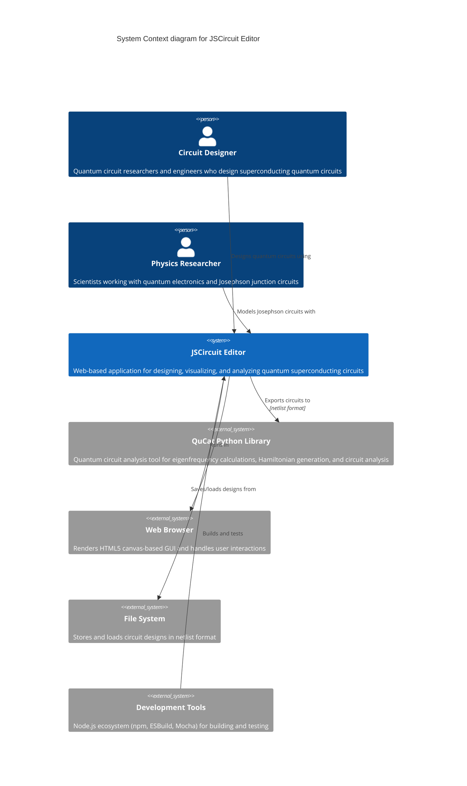

# C4 Level 1: System Context

This diagram shows the overall system context for the JSCircuit Editor, including users and external systems.

## Key Elements

### Users
- **Circuit Designer**: Primary user who creates and modifies quantum circuit designs
- **Physics Researcher**: Secondary user who uses the tool for quantum electronics modeling

### System Purpose
The JSCircuit Editor enables graphical design of quantum superconducting circuits with components like Josephson junctions, capacitors, inductors, and resistors.

### External Dependencies
- **QuCat Python Library**: Target system for circuit analysis
- **Web Browser**: Runtime environment for the application
- **File System**: Persistence layer for circuit designs
- **Development Tools**: Build and testing infrastructure