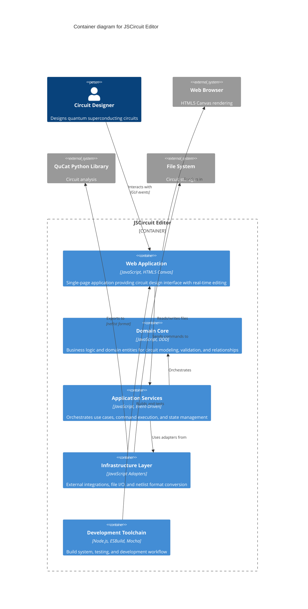

# C4 Level 2: Containers

This diagram shows the high-level containers that make up the JSCircuit Editor and how they interact.

## Container Descriptions

### Web Application
- **Technology**: Modern JavaScript (ES modules), HTML5 Canvas, CSS
- **Purpose**: Single-page web application providing the circuit design interface
- **Responsibilities**: User interaction, visual circuit rendering, real-time editing

### Domain Core
- **Technology**: Pure JavaScript with Domain-Driven Design patterns
- **Purpose**: Business logic and domain entities for circuit modeling
- **Responsibilities**: Circuit validation, element relationships, domain rules

### Application Services
- **Technology**: JavaScript with Event-Driven Architecture
- **Purpose**: Orchestrates use cases and coordinates between GUI and domain
- **Responsibilities**: Command execution, state management, event broadcasting

### Infrastructure Layer
- **Technology**: JavaScript adapters and repositories
- **Purpose**: External integrations and persistence
- **Responsibilities**: File I/O, netlist export/import, QuCat format conversion

### Development Toolchain
- **Technology**: ESBuild, Mocha, npm
- **Purpose**: Build system, testing, and development workflow
- **Responsibilities**: Bundling, test execution, asset management