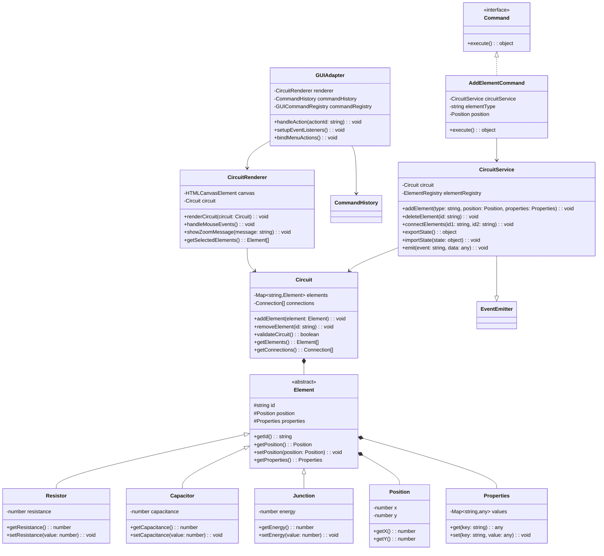

# C4 Level 4: Code

This diagram shows the key classes and their relationships in the JSCircuit Editor.

## Key Classes

### Core Domain Classes

#### Circuit (Aggregate Root)
- **Purpose**: Central aggregate managing the entire circuit state
- **Responsibilities**: Element management, validation, state consistency
- **Key Methods**: addElement(), removeElement(), validateCircuit()

#### Element (Abstract Base)
- **Purpose**: Base class for all circuit components
- **Concrete Implementations**: Resistor, Capacitor, Inductor, Junction, Ground, Wire
- **Key Properties**: id, position, properties

#### Value Objects
- **Position**: Immutable coordinate representation (x, y)
- **Properties**: Key-value store for element-specific attributes
- **Label**: Text identifier for elements

### Application Service Pattern

#### CircuitService
- **Purpose**: Main orchestrator for circuit operations
- **Pattern**: Application Service + Event Emitter
- **Responsibilities**: Command coordination, state management, event broadcasting

### GUI Architecture

#### GUIAdapter
- **Purpose**: Bridge between UI events and domain commands
- **Pattern**: Adapter + Mediator
- **Responsibilities**: Event handling, command routing, UI coordination

#### CircuitRenderer
- **Purpose**: Canvas-based visual representation of circuits
- **Technology**: HTML5 Canvas API
- **Responsibilities**: Rendering, user interaction, visual feedback

### Command Pattern Implementation

#### Command Interface
- **Purpose**: Encapsulate user actions as executable objects
- **Pattern**: Command Pattern
- **Implementations**: AddElementCommand, DeleteElementCommand, RotateElementCommand

## Design Patterns Used

1. **Domain-Driven Design (DDD)**: Clear separation of domain logic
2. **Command Pattern**: All user actions as reversible commands
3. **Factory Pattern**: Element and renderer creation
4. **Observer Pattern**: Event-driven GUI updates
5. **Repository Pattern**: Data persistence abstraction
6. **Adapter Pattern**: External system integration